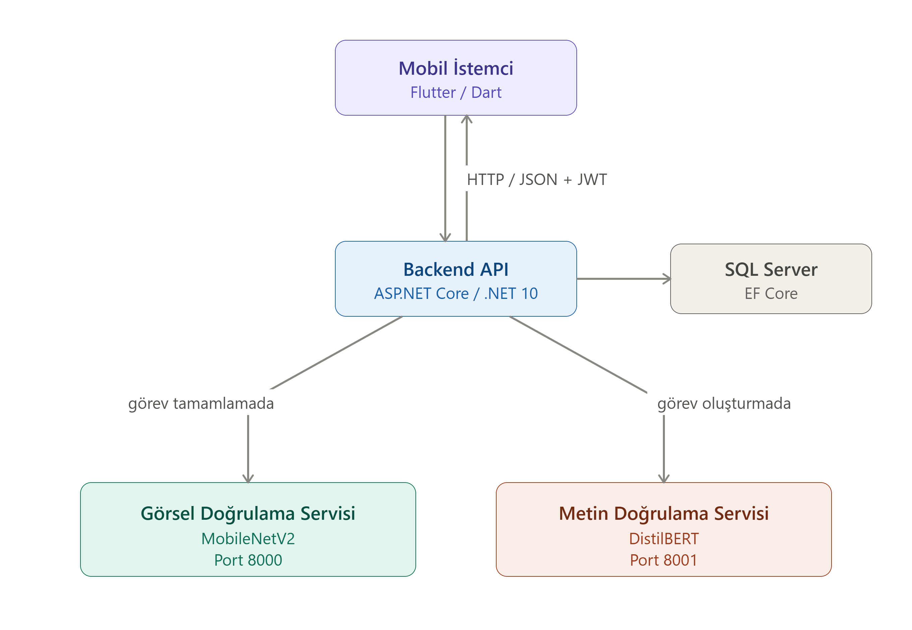
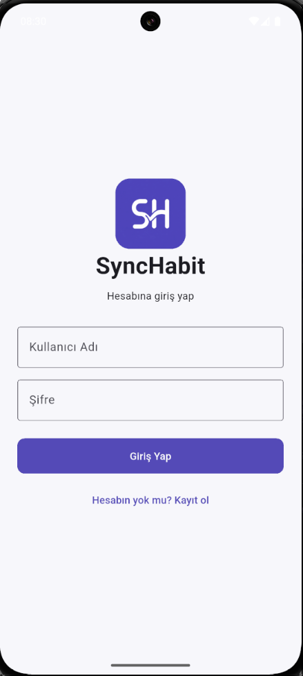
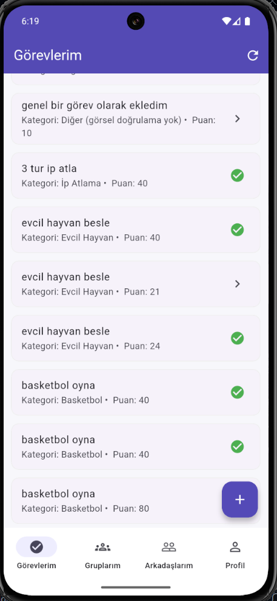
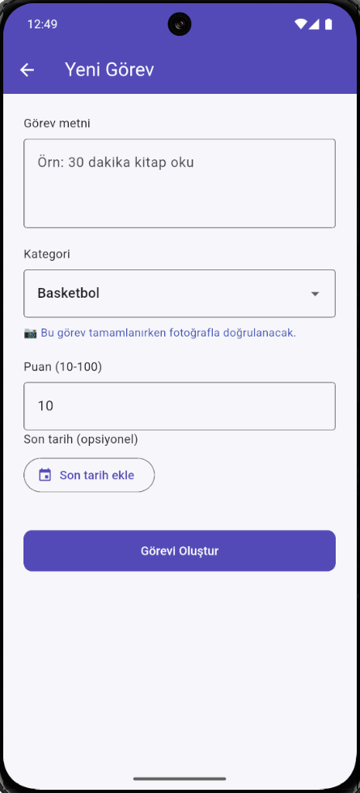
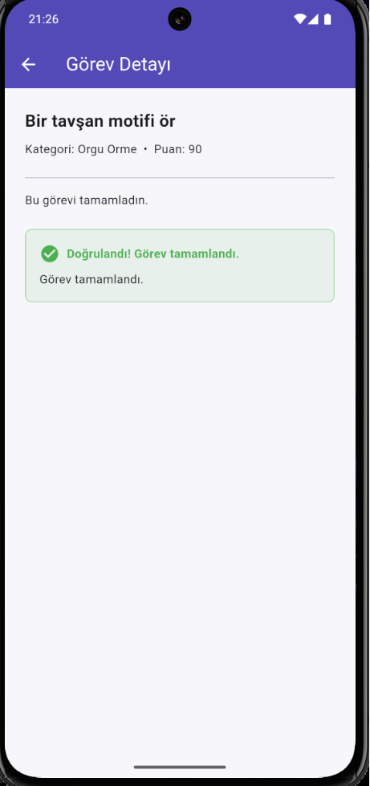
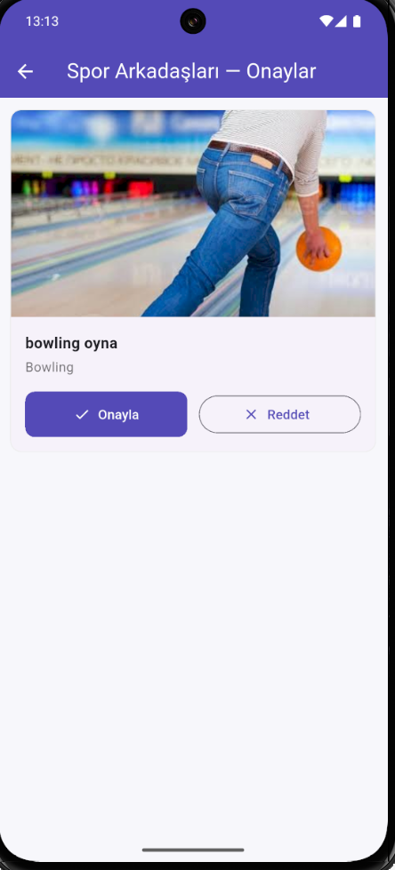
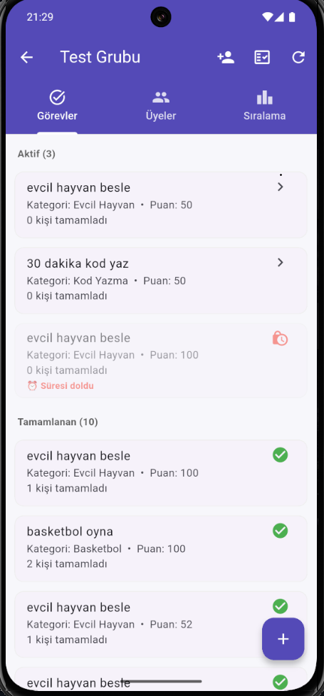
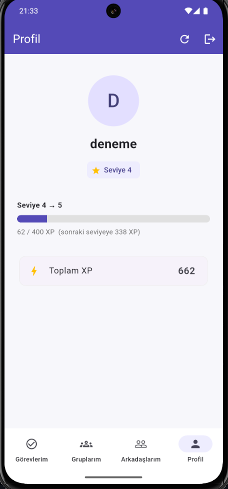

# 📱 SyncHabit — Yapay Zeka Doğrulamalı Alışkanlık Takip Uygulaması

Kullanıcıların alışkanlık/görev belirleyip tamamladığı, tamamlamanın **yapay zeka ile doğrulandığı** sosyal ve oyunlaştırılmış bir mobil uygulama. Çoğu alışkanlık uygulaması kullanıcının "yaptım" beyanına güvenir; SyncHabit ise tamamlamayı **kanıta dayalı** doğrular: kullanıcı fotoğraf yükler, yapay zeka fotoğrafın göreve uygunluğunu denetler.

Bu proje bir **lisans bitirme tezi** kapsamında geliştirilmiştir.

---

## Özellikler

- **Yapay zeka ile görsel doğrulama** — yüklenen fotoğraf, görüntü sınıflandırma modeliyle (MobileNetV2) görevin kategorisine uygunluğu açısından denetlenir
- **Metin analizi (NLP)** — görev metinleri, zararlı/uygunsuz içerik için DistilBERT tabanlı modelle kontrol edilir
- **Üç katmanlı doğrulama kararı** — kategori eşleşmesi → güven skoru → bağlama göre otomatik onay veya manuel inceleme
- **Bireysel ve grup görevleri** — kişisel takip veya grup halinde ortak görevler
- **Sosyal sistem** — arkadaş ekleme, grup oluşturma, gruba davet
- **Grup lideri onayı** — yapay zekanın emin olamadığı tamamlamalar liderin manuel onayına düşer
- **Oyunlaştırma** — XP, seviye sistemi ve grup içi sıralama (leaderboard)
- **Son tarih (deadline)** — görevlere opsiyonel süre; süresi geçen görev kilitlenir
- **Kimlik doğrulama** — JWT tabanlı güvenli giriş, otomatik oturum

---

## Kullanılan Teknolojiler

| Teknoloji                              | Amaç                                |
| -------------------------------------- | ----------------------------------- |
| Flutter (Dart)                         | Mobil uygulama arayüzü              |
| Provider                               | Mobil state yönetimi                |
| ASP.NET Core (.NET 10)                 | Backend API                         |
| Entity Framework Core                  | Veritabanı erişimi (ORM)            |
| SQL Server                             | Veritabanı                          |
| JWT + BCrypt                           | Kimlik doğrulama ve şifre güvenliği |
| Python                                 | Yapay zeka servisleri               |
| TensorFlow / Keras (MobileNetV2)       | Görüntü sınıflandırma               |
| Hugging Face Transformers (DistilBERT) | Metin analizi (NLP)                 |

---

## Mimari

Sistem üç bağımsız katmandan oluşur:

| Katman                | Teknoloji                 | Görevi                                             |
| --------------------- | ------------------------- | -------------------------------------------------- |
| Mobil İstemci         | Flutter                   | Kullanıcı arayüzü, yalnızca backend ile haberleşir |
| Backend API           | ASP.NET Core + SQL Server | İş mantığı, kimlik doğrulama, veri, AI'a aracılık  |
| Yapay Zeka Servisleri | Python (2 servis)         | Görsel sınıflandırma ve metin analizi              |

**Veri akışı:** Mobil → Backend → Yapay Zeka Servisi → Backend → Mobil.
Mobil istemci yapay zeka servisleriyle doğrudan konuşmaz; tüm iletişim backend üzerinden geçer.



---

## Yapay Zeka Doğrulama Mantığı

Bir fotoğraf yüklendiğinde şu üç aşamalı karar uygulanır:

1. **Kategori eşleşmesi** — modelin tahmini görevin kategorisiyle eşleşmiyorsa fotoğraf reddedilir
2. **Güven skoru** — yüksek güven: doğrulandı; orta güven: manuel incelemeye düşer; düşük güven: reddedilir
3. **Bağlama göre yönlendirme** — bireysel görevlerde otomatik karar; grup görevlerinde belirsiz durumlar lider onayına gider

---

## Kurulum

> Proje yerel geliştirme ortamı için yapılandırılmıştır; backend ve yapay zeka servisleri aynı makinede çalışır.

```bash
# Projeyi klonlayın
git clone https://github.com/Maliyldz/synchabit.git

# Klasöre girin
cd synchabit
```

### 1. Yapay zeka modelini indirin

NLP modeli (DistilBERT) boyutu nedeniyle depoya dahil değildir. [Releases](https://github.com/Maliyldz/synchabit/releases) sayfasından `distilbert.zip` dosyasını indirip açın ve `AI_Python/nlp_model/models/` klasörüne yerleştirin.
_(Görsel model depoda mevcuttur, ayrıca indirmeye gerek yoktur.)_

### 2. Backend yapılandırması

`Backend_CSharp/SyncHabit.API/appsettings.example.json` dosyasını `appsettings.json` olarak kopyalayın ve doldurun:

- **Jwt:Key** — en az 32 karakterlik rastgele bir anahtar
- **ConnectionStrings:DefaultConnection** — kendi SQL Server bağlantınız

### 3. Servisleri başlatın

```bash
# Yapay zeka servisleri (Python)

# Görsel model servisi
cd AI_Python/vision_model
python scripts/server.py

# NLP model servisi (ayrı bir terminalde)
cd AI_Python/nlp_model
python inference_server_bert.py

# Backend (.NET)
cd Backend_CSharp/SyncHabit.API
dotnet run

# Mobil (Flutter)
cd Mobile_Flutter/synchabit_app
flutter run
```

---

## Klasör Yapısı

```
synchabit/
├── Backend_CSharp/      # ASP.NET Core Web API (.NET 10)
│   └── SyncHabit.API/   # Controllers, Services, Models, Data
├── AI_Python/           # Yapay zeka servisleri
│   ├── vision_model/    # Görüntü sınıflandırma (MobileNetV2)
│   └── nlp_model/       # Metin analizi (DistilBERT)
└── Mobile_Flutter/      # Flutter mobil uygulama
    └── synchabit_app/   # Ekranlar, servisler, provider'lar, modeller
```

---

## Ekran Görüntüleri

### Giriş



### Görev Listesi



### Görev Oluşturma



### Yapay Zeka Doğrulama



### Manuel Grup Lideri Doğrulama



### Grup Detayı



### Profil / Seviye



---

## Geliştirici

Mehmet Ali YILDIZ — Yalova Üniversitesi, Bilgisayar Mühendisliği, Bitirme Tezi, 2026
